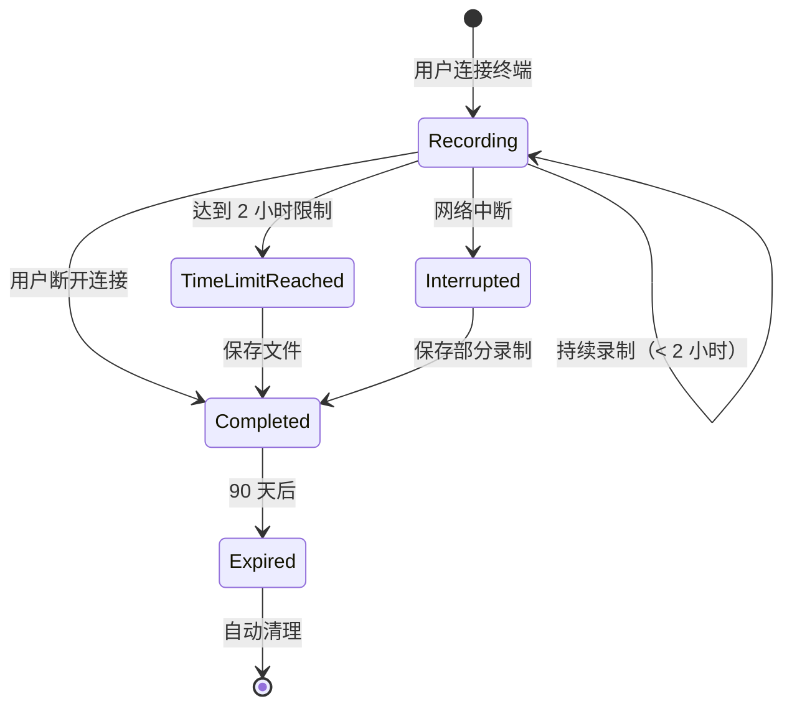
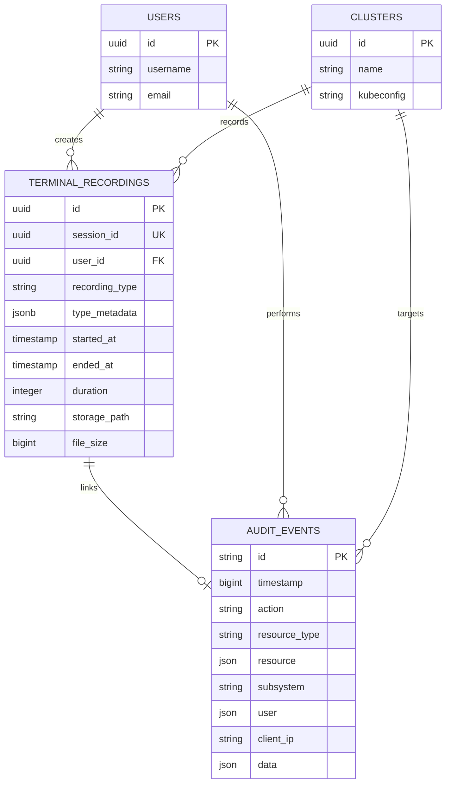
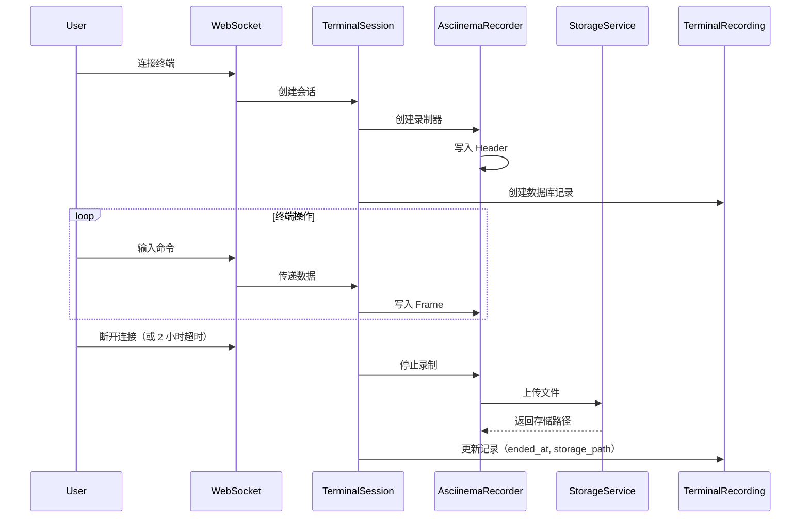
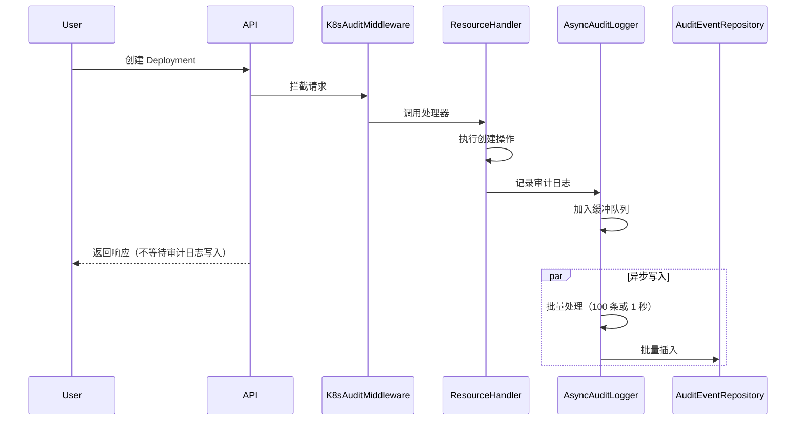

# 数据模型设计：K8s 终端录制与审计增强

**日期**: 2025-10-27
**基于**: spec.md + research.md
**状态**: 已定稿

## 概述

本文档定义 K8s 终端录制与审计增强功能的数据模型。基于现有的 009-3 统一终端录制系统和统一 AuditEvent 系统，通过扩展（而非重写）支持 K8s 终端类型和审计子系统。

---

## 实体 1：TerminalRecording（扩展 009-3 模型）

### 概述

**用途**：存储所有类型的终端会话录制（Docker、WebSSH、K8s 节点、K8s Pod）
**表名**：`terminal_recordings`
**主键**：`id` (UUID)
**外键**：`user_id` → `users.id`

### 已有字段（无需修改）

| 字段 | 类型 | 约束 | 说明 |
|-----|------|------|------|
| `id` | UUID | PRIMARY KEY | 录制 ID |
| `session_id` | UUID | NOT NULL, UNIQUE | 会话 ID（对应 WebSocket 连接） |
| `user_id` | UUID | NOT NULL, FK | 操作用户 ID |
| `username` | VARCHAR(255) | NOT NULL | 操作用户名（冗余，便于查询） |
| `recording_type` | VARCHAR(50) | NOT NULL, INDEX | 录制类型（扩展支持 K8s） |
| `type_metadata` | JSONB | NULL | 类型特定元数据（扩展支持 K8s） |
| `started_at` | TIMESTAMP | NOT NULL, INDEX | 录制开始时间 |
| `ended_at` | TIMESTAMP | NULL, INDEX | 录制结束时间 |
| `duration` | INTEGER | DEFAULT 0 | 录制时长（秒） |
| `storage_type` | VARCHAR(50) | DEFAULT 'local' | 存储类型（local/minio） |
| `storage_path` | TEXT | NOT NULL | 存储路径 |
| `file_size` | BIGINT | DEFAULT 0 | 文件大小（字节） |
| `format` | VARCHAR(50) | DEFAULT 'asciinema' | 录制格式 |
| `rows` | INTEGER | DEFAULT 30 | 终端行数 |
| `cols` | INTEGER | DEFAULT 120 | 终端列数 |
| `shell` | VARCHAR(255) | NULL | Shell 类型 |
| `client_ip` | VARCHAR(255) | NULL | 客户端 IP |
| `description` | TEXT | NULL | 描述 |
| `tags` | TEXT | NULL | 标签（逗号分隔） |
| `created_at` | TIMESTAMP | NOT NULL | 创建时间 |
| `updated_at` | TIMESTAMP | NOT NULL | 更新时间 |

### 扩展字段说明

#### `recording_type` 扩展值

**已有值**：
- `docker` - Docker 容器终端
- `webssh` - WebSSH 主机终端

**新增值**（K8s 支持）：
- `k8s_node` - **K8s 节点终端**（FR-106）
- `k8s_pod` - **K8s Pod 容器终端**（FR-206）

#### `type_metadata` 扩展结构

**K8s 节点终端**（`recording_type = "k8s_node"`）：
```json
{
  "cluster_id": "550e8400-e29b-41d4-a716-446655440000",
  "node_name": "node-1"
}
```

**K8s Pod 容器终端**（`recording_type = "k8s_pod"`）：
```json
{
  "cluster_id": "550e8400-e29b-41d4-a716-446655440000",
  "namespace": "default",
  "pod_name": "nginx-6c8b5b5d4f-abc123",
  "container_name": "nginx"
}
```

**字段说明**：
- `cluster_id` (UUID，必填)：集群 ID，关联 `clusters.id`
- `node_name` (string，节点终端必填)：节点名称
- `namespace` (string，容器终端必填)：命名空间
- `pod_name` (string，容器终端必填)：Pod 名称
- `container_name` (string，容器终端必填)：容器名称

### 验证规则

#### 现有验证（继承 009-3）

1. **会话 ID 唯一性**：`session_id` 必须唯一
2. **用户关联**：`user_id` 必须存在于 `users` 表
3. **时间一致性**：`ended_at` >= `started_at`（如果 `ended_at` 不为 NULL）
4. **文件大小非负**：`file_size` >= 0
5. **时长非负**：`duration` >= 0

#### 新增验证（K8s 支持）

**FR-304**：**2 小时时长限制**
```sql
CHECK (duration <= 7200) -- 7200 秒 = 2 小时
```

**FR-307**：**90 天保留期检查**
```go
func (r *TerminalRecording) IsExpired() bool {
    if r.EndedAt == nil {
        return false // 活动会话不过期
    }
    cutoffTime := time.Now().AddDate(0, 0, -90)
    return r.EndedAt.Before(cutoffTime)
}
```

**类型元数据完整性**：
```go
func (r *TerminalRecording) ValidateTypeMetadata() error {
    switch r.RecordingType {
    case "k8s_node":
        if r.TypeMetadata["cluster_id"] == "" || r.TypeMetadata["node_name"] == "" {
            return errors.New("k8s_node requires cluster_id and node_name")
        }
    case "k8s_pod":
        required := []string{"cluster_id", "namespace", "pod_name", "container_name"}
        for _, field := range required {
            if r.TypeMetadata[field] == "" {
                return fmt.Errorf("k8s_pod requires %s", field)
            }
        }
    }
    return nil
}
```

### 索引

**已有索引**（009-3）：
- `idx_terminal_recordings_session_id` UNIQUE (`session_id`)
- `idx_terminal_recordings_user_id` (`user_id`)
- `idx_terminal_recordings_recording_type` (`recording_type`)
- `idx_terminal_recordings_started_at` (`started_at`)
- `idx_terminal_recordings_ended_at` (`ended_at`)
- `idx_terminal_recordings_cleanup` (`ended_at`, `file_size`, `duration`) WHERE `ended_at` IS NOT NULL

**新增索引**（K8s 支持）：
```sql
-- 按集群查询 K8s 录制
CREATE INDEX idx_terminal_recordings_k8s_cluster
ON terminal_recordings((type_metadata->>'cluster_id'))
WHERE recording_type IN ('k8s_node', 'k8s_pod');

-- 按节点名称查询
CREATE INDEX idx_terminal_recordings_k8s_node
ON terminal_recordings((type_metadata->>'node_name'))
WHERE recording_type = 'k8s_node';

-- 按 Pod 名称查询
CREATE INDEX idx_terminal_recordings_k8s_pod
ON terminal_recordings((type_metadata->>'pod_name'))
WHERE recording_type = 'k8s_pod';
```

### 状态转换



---

## 实体 2：AuditEvent（扩展统一审计模型）

### 概述

**用途**：记录所有子系统的审计事件（HTTP、MinIO、Database、Kubernetes 等）
**表名**：`audit_events`
**主键**：`id` (VARCHAR 255，UUID 字符串)
**无外键**：为提升性能，不使用外键约束

### 已有字段（无需修改）

| 字段 | 类型 | 约束 | 说明 |
|-----|------|------|------|
| `id` | VARCHAR(255) | PRIMARY KEY | 审计事件 ID（UUID） |
| `timestamp` | BIGINT | NOT NULL, INDEX | Unix 毫秒时间戳 |
| `action` | VARCHAR(64) | NOT NULL, INDEX | 操作类型（扩展支持 K8s） |
| `resource_type` | VARCHAR(64) | NOT NULL, INDEX | 资源类型（扩展支持 K8s） |
| `resource` | TEXT (JSON) | NOT NULL | 资源详情（JSON 序列化） |
| `subsystem` | VARCHAR(32) | NOT NULL, INDEX | 子系统标识（扩展支持 K8s） |
| `user` | TEXT (JSON) | NOT NULL | 操作主体（JSON 序列化） |
| `space_path` | VARCHAR(512) | NULL | 空间路径（可选） |
| `diff_object` | TEXT (JSON) | NULL | 差异对象（JSON 序列化） |
| `client_ip` | VARCHAR(45) | NOT NULL, INDEX | 客户端 IP |
| `user_agent` | TEXT | NULL | 用户代理 |
| `request_method` | VARCHAR(16) | NULL | 请求方法（GET/POST 等） |
| `request_id` | VARCHAR(128) | INDEX | 请求 ID |
| `data` | TEXT (JSON) | NULL | 自定义数据（JSON 序列化） |
| `created_at` | TIMESTAMP | NOT NULL, INDEX | 创建时间 |

### 扩展字段说明

#### `subsystem` 扩展值

**已有值**：
- `http` - 通用 HTTP API
- `minio` - MinIO 对象存储
- `database` - 数据库管理
- `docker` - Docker 实例管理
- `host` - 主机监控
- `webssh` - WebSSH 终端

**新增值**（K8s 支持）：
- `kubernetes` - **K8s 集群管理**（FR-407）

**实现**（internal/models/audit_event.go）：
```go
const (
    SubsystemKubernetes SubsystemType = "kubernetes" // 已定义 ✅
)
```

#### `action` 扩展值

**已有值**：
- `created`, `updated`, `deleted`, `read`
- `enabled`, `disabled`
- `login`, `logout`
- `granted`, `revoked`

**新增值**（K8s 资源操作）：
```go
const (
    ActionCreateResource    Action = "CreateResource"    // FR-401
    ActionUpdateResource    Action = "UpdateResource"    // FR-402
    ActionDeleteResource    Action = "DeleteResource"    // FR-403
    ActionViewResource      Action = "ViewResource"      // FR-701（只读操作）

    ActionNodeTerminalAccess Action = "NodeTerminalAccess" // FR-501
    ActionPodTerminalAccess  Action = "PodTerminalAccess"  // FR-502
)
```

#### `resource_type` 扩展值

**已有值**：
- `cluster`, `pod`, `deployment`, `service`, `configMap`, `secret`
- `database`, `databaseInstance`, `databaseUser`
- `minio`, `redis`, `mysql`, `postgresql`
- `user`, `role`, `instance`

**新增值**（K8s 终端）：
```go
const (
    ResourceTypeK8sNode ResourceType = "k8s_node" // FR-501
    ResourceTypeK8sPod  ResourceType = "k8s_pod"  // FR-502
)
```

#### `resource.data` 结构（K8s 审计）

**字段定义**：
```typescript
interface K8sAuditResourceData {
  cluster_id: string;          // 集群 ID（UUID）
  cluster_name?: string;        // 集群名称（冗余，便于展示）
  namespace?: string;           // 命名空间（可选，集群级资源无命名空间）
  resource_name: string;        // 资源名称
  change_summary?: string;      // 变更摘要（仅更新操作）
  recording_id?: string;        // 关联的录制 ID（仅终端访问）
  success: string;              // 操作结果（"true"/"false"）
  error_message?: string;       // 错误信息（失败时）
}
```

**示例**：

**资源创建审计**：
```json
{
  "cluster_id": "550e8400-e29b-41d4-a716-446655440000",
  "cluster_name": "prod-cluster",
  "namespace": "default",
  "resource_name": "nginx-deployment",
  "success": "true"
}
```

**资源更新审计**（包含变更摘要）：
```json
{
  "cluster_id": "550e8400-e29b-41d4-a716-446655440000",
  "namespace": "default",
  "resource_name": "nginx-deployment",
  "change_summary": "replicas: 3 -> 5\nimage: nginx:1.19 -> nginx:1.21",
  "success": "true"
}
```

**终端访问审计**（关联录制 ID）：
```json
{
  "cluster_id": "550e8400-e29b-41d4-a716-446655440000",
  "resource_name": "node-1",
  "recording_id": "7c9e6679-7425-40de-944b-e07fc1f90ae7",
  "success": "true"
}
```

### 验证规则

#### 现有验证（继承统一审计系统）

1. **ID 必填**：`id` 不能为空
2. **时间戳有效性**：`timestamp` > 0
3. **操作类型有效性**：`action` 必须是合法枚举值
4. **资源类型有效性**：`resource_type` 必须是合法枚举值
5. **子系统有效性**：`subsystem` 必须是合法枚举值
6. **用户信息完整性**：`user.uid` 和 `user.username` 必填
7. **客户端 IP 必填**：`client_ip` 不能为空
8. **差异对象大小限制**：`diff_object.old_object` 和 `new_object` 各不超过 64KB

#### 新增验证（K8s 支持）

**FR-801**：**90 天保留期检查**
```go
func (ae *AuditEvent) IsExpired() bool {
    createdAt := time.Unix(0, ae.Timestamp*1e6) // 毫秒转纳秒
    cutoffTime := time.Now().AddDate(0, 0, -90)
    return createdAt.Before(cutoffTime)
}
```

**FR-704**：**只读操作筛选**
```go
func (ae *AuditEvent) IsReadOnlyOperation() bool {
    return ae.Action == ActionViewResource
}

func (ae *AuditEvent) IsModifyOperation() bool {
    return ae.Action == ActionCreateResource ||
           ae.Action == ActionUpdateResource ||
           ae.Action == ActionDeleteResource
}
```

### 索引

**已有索引**（统一审计系统）：
- `idx_audit_events_timestamp` (`timestamp`)
- `idx_audit_events_action` (`action`)
- `idx_audit_events_resource_type` (`resource_type`)
- `idx_audit_events_subsystem` (`subsystem`)
- `idx_audit_events_composite` (`resource_type`, `action`, `timestamp`)
- `idx_audit_events_client_ip` (`client_ip`)
- `idx_audit_events_request_id` (`request_id`)

**新增索引**（K8s 专用优化）：

**PostgreSQL 部分索引**（仅索引 Kubernetes 子系统）：
```sql
-- 查询优化：subsystem + resource_type + action + timestamp
CREATE INDEX idx_audit_events_k8s_query
ON audit_events(resource_type, action, timestamp DESC)
WHERE subsystem = 'kubernetes';

-- 覆盖索引：避免回表查询
CREATE INDEX idx_audit_events_k8s_covering
ON audit_events(subsystem, timestamp DESC)
INCLUDE (id, action, resource_type, resource)
WHERE subsystem = 'kubernetes';
```

**MySQL 复合索引**（不支持部分索引，使用全量索引）：
```sql
CREATE INDEX idx_audit_events_k8s_query
ON audit_events(subsystem, resource_type, action, timestamp DESC);
```

### 状态转换

审计事件不可变（Write-Once），无状态转换。

**生命周期**：
```
创建（Write） → 查询（Read） → 过期（90 天后） → 清理（Delete）
```

---

## 实体 3：K8sTerminalSession（内存结构，非数据库实体）

### 概述

**用途**：管理活动的 K8s 终端会话，协调录制和审计
**存储**：内存（map 或 sync.Map）
**生命周期**：终端连接时创建，断开时销毁

### 字段定义

```go
type K8sTerminalSession struct {
    // 会话标识
    SessionID    uuid.UUID  // 会话 ID（对应 WebSocket 连接）
    Type         string     // 录制类型："k8s_node" 或 "k8s_pod"

    // K8s 资源信息
    ClusterID    uuid.UUID  // 集群 ID
    NodeName     string     // 节点名称（仅节点终端，否则为空）
    Namespace    string     // 命名空间（仅容器终端，否则为空）
    PodName      string     // Pod 名称（仅容器终端，否则为空）
    ContainerName string    // 容器名称（仅容器终端，否则为空）

    // 录制管理
    RecordingID  uuid.UUID           // 关联的 TerminalRecording ID
    RecordingState string            // 录制状态："recording", "stopped", "time_limit_reached"
    Recorder     *AsciinemaRecorder  // 录制器实例

    // 时间管理
    StartedAt    time.Time  // 开始时间
    Timer        *time.Timer // 2 小时定时器

    // WebSocket 连接
    Conn         *websocket.Conn // WebSocket 连接
    SizeChan     chan *remotecommand.TerminalSize // 终端大小变化通道

    // 用户信息
    UserID       uuid.UUID // 用户 ID
    Username     string    // 用户名
    ClientIP     string    // 客户端 IP

    // 同步控制
    Mutex        sync.RWMutex // 读写锁
}
```

### 方法

#### 创建会话

```go
func NewK8sTerminalSession(
    sessionType string,
    clusterID uuid.UUID,
    userID uuid.UUID,
    username string,
    clientIP string,
    conn *websocket.Conn,
) *K8sTerminalSession {
    session := &K8sTerminalSession{
        SessionID:      uuid.New(),
        Type:           sessionType,
        ClusterID:      clusterID,
        UserID:         userID,
        Username:       username,
        ClientIP:       clientIP,
        Conn:           conn,
        SizeChan:       make(chan *remotecommand.TerminalSize, 10),
        StartedAt:      time.Now(),
        RecordingState: "recording",
    }

    // 创建录制 ID
    session.RecordingID = uuid.New()

    return session
}
```

#### 启动录制

```go
func (s *K8sTerminalSession) StartRecording(recorder *AsciinemaRecorder) {
    s.Mutex.Lock()
    defer s.Mutex.Unlock()

    s.Recorder = recorder
    s.RecordingState = "recording"

    // 启动 2 小时定时器
    s.Timer = time.AfterFunc(2*time.Hour, func() {
        s.handleRecordingTimeout()
    })
}
```

#### 处理录制超时

```go
func (s *K8sTerminalSession) handleRecordingTimeout() {
    s.Mutex.Lock()
    defer s.Mutex.Unlock()

    if s.RecordingState != "recording" {
        return // 已停止，无需处理
    }

    // 停止录制
    s.Recorder.Stop()
    s.RecordingState = "time_limit_reached"

    // 发送 WebSocket 通知
    s.SendMessage("recording_limit", "Recording stopped: 2 hour limit reached")

    // 注意：不关闭 WebSocket 连接（保持终端可用）
}
```

#### 停止录制

```go
func (s *K8sTerminalSession) StopRecording() error {
    s.Mutex.Lock()
    defer s.Mutex.Unlock()

    if s.RecordingState == "stopped" {
        return nil // 已停止
    }

    // 取消定时器
    if s.Timer != nil {
        s.Timer.Stop()
    }

    // 停止录制器
    if s.Recorder != nil {
        s.Recorder.Stop()
    }

    s.RecordingState = "stopped"
    return nil
}
```

#### 关闭会话

```go
func (s *K8sTerminalSession) Close() error {
    // 停止录制
    s.StopRecording()

    // 关闭 WebSocket 连接
    if s.Conn != nil {
        s.Conn.Close()
    }

    // 关闭通道
    close(s.SizeChan)

    return nil
}
```

### 全局会话管理器

```go
type SessionManager struct {
    sessions sync.Map // map[uuid.UUID]*K8sTerminalSession
}

func (m *SessionManager) AddSession(session *K8sTerminalSession) {
    m.sessions.Store(session.SessionID, session)
}

func (m *SessionManager) GetSession(sessionID uuid.UUID) (*K8sTerminalSession, bool) {
    value, ok := m.sessions.Load(sessionID)
    if !ok {
        return nil, false
    }
    return value.(*K8sTerminalSession), true
}

func (m *SessionManager) RemoveSession(sessionID uuid.UUID) {
    if session, ok := m.GetSession(sessionID); ok {
        session.Close()
        m.sessions.Delete(sessionID)
    }
}
```

---

## 实体关系图



---

## 数据流图

### 终端录制数据流



### 审计日志数据流



---

## 数据大小估算

### TerminalRecording

**单条记录大小**：
- 基础字段：约 500 字节
- `type_metadata`（K8s）：约 200 字节（JSON）
- **总计：约 700 字节/条**

**存储估算**（100 并发，10 分钟/天，90 天保留）：
- 录制记录：100 × 30 天 × 90 天 = 270,000 条
- 数据库大小：270,000 × 700 字节 = 约 189MB

**录制文件大小**：
- 10 分钟录制：约 1-3MB（Asciinema 文本格式）
- 90 天保留：270,000 × 2MB = 约 540GB

### AuditEvent

**单条记录大小**：
- 基础字段：约 800 字节
- `resource` JSON：约 300 字节
- `data` JSON：约 200 字节
- **总计：约 1300 字节/条**

**存储估算**（1000 日均日志，90 天保留）：
- 审计记录：1000 × 90 天 = 90,000 条
- 数据库大小：90,000 × 1300 字节 = 约 117MB

**启用只读审计后**：
- 日均日志：10,000-50,000 条（增加 10-50 倍）
- 90 天保留：4,500,000 条（最大）
- 数据库大小：4,500,000 × 1300 字节 = 约 5.85GB

---

## 迁移脚本

**无需数据库迁移**：
- ✅ `TerminalRecording` 已支持 `recording_type` 和 `type_metadata`（JSONB 灵活扩展）
- ✅ `AuditEvent` 已支持 `subsystem` 和自定义 `action`/`resource_type`

**需要代码变更**：
1. 添加 K8s 常量到 `internal/models/terminal_recording.go` 和 `audit_event.go`
2. 添加新索引（通过 GORM `AfterMigrate` 钩子或手动 SQL）

**索引创建示例**（PostgreSQL）：
```sql
-- 在生产环境执行（CONCURRENT 避免锁表）
CREATE INDEX CONCURRENTLY idx_terminal_recordings_k8s_cluster
ON terminal_recordings((type_metadata->>'cluster_id'))
WHERE recording_type IN ('k8s_node', 'k8s_pod');

CREATE INDEX CONCURRENTLY idx_audit_events_k8s_query
ON audit_events(resource_type, action, timestamp DESC)
WHERE subsystem = 'kubernetes';
```

---

## 测试数据

### 示例：K8s 节点终端录制

```json
{
  "id": "7c9e6679-7425-40de-944b-e07fc1f90ae7",
  "session_id": "a1b2c3d4-e5f6-7890-abcd-ef1234567890",
  "user_id": "550e8400-e29b-41d4-a716-446655440000",
  "username": "admin",
  "recording_type": "k8s_node",
  "type_metadata": {
    "cluster_id": "c1d2e3f4-a5b6-7890-cdef-1234567890ab",
    "node_name": "node-1"
  },
  "started_at": "2025-10-27T10:00:00Z",
  "ended_at": "2025-10-27T10:15:30Z",
  "duration": 930,
  "storage_type": "local",
  "storage_path": "/var/lib/tiga/recordings/k8s_node/2025-10-27/7c9e6679-7425-40de-944b-e07fc1f90ae7.cast",
  "file_size": 2458624,
  "format": "asciinema",
  "rows": 30,
  "cols": 120,
  "client_ip": "192.168.1.100"
}
```

### 示例：K8s 资源创建审计

```json
{
  "id": "8d7c6b5a-4321-fedc-ba98-76543210abcd",
  "timestamp": 1730019600000,
  "action": "CreateResource",
  "resource_type": "deployment",
  "resource": {
    "type": "deployment",
    "identifier": "nginx-deployment",
    "data": {
      "cluster_id": "c1d2e3f4-a5b6-7890-cdef-1234567890ab",
      "cluster_name": "prod-cluster",
      "namespace": "default",
      "resource_name": "nginx-deployment",
      "success": "true"
    }
  },
  "subsystem": "kubernetes",
  "user": {
    "uid": "550e8400-e29b-41d4-a716-446655440000",
    "username": "admin",
    "type": "user"
  },
  "client_ip": "192.168.1.100",
  "request_method": "POST",
  "created_at": "2025-10-27T10:00:00Z"
}
```

---

**文档完成日期**：2025-10-27
**下一步**：生成 API 契约（contracts/）和快速启动指南（quickstart.md）
